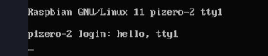

# Remote Control Slideshow

Controlling the default tty / framebuffer on a raspberry pi zero w.

## The Login Screen

When you power on a raspberry pi, after a lot of status messages etc scroll through the pi presents a login prompt:


This screen is `tty1`. You can find it in the `/dev/tty1` device on the filesystem.


## Printing to tty1 from _another_ `tty`

A super user can write directly to this `tty1` device, being that tty devices are text-mode terminals in a simple sense.

So, it is possible to write text to the device.


### Now the login screen has new characters printed on it...



## Clearing the screen and printing something using ansi codes

Using terminal escape codes it is possible to send commands to `tty1` much as you would on the tty you are currently using.

The escape code `\033c` will clear the screen. So we can execute a simple command to clear the screen before it says hello:


### Now the entire terminal `tty1` has been cleared.


## This unlocks some powerful abilities.

It is possible to log in through ssh and drive the monitor connected to a raspberry pi remotely. This is excellent for presentations - for example we could use [catimg](https://github.com/posva/catimg) to send ascii art to the monitor connected to the raspberry pi (`tty1`) - sometimes it looks cool, sometimes not so much - YMMV ;)

```bash
sudo -- sh -c 'echo "\033c" > /dev/tty1 ; catimg Pictures/yoda.jpg > /dev/tty1'
```


## It looks like Yoda to me!

Ok so now it's pretty straight forward to write a little script that pushes a bunch of ascii to `tty1` from a file in the (say,) `Pictures` folder.

That way, we can make a _slideshow_ type script:

1. clear the screen
2. blast some ascii
3. wait _x_ seconds

The [example script](./show-ascii-image-on-tty1.sh) proves that we can do that.
```bash
#!/bin/sh

echo "\033c" > /dev/tty1

catimg /home/user/Pictures/yoda.jpg > /dev/tty1

sleep 5

echo "\033c" > /dev/tty1

catimg /home/user/Pictures/darth-vader.jpg > /dev/tty1

```

## Making it a continuous thing

The [Raspberry Pi OS Lite](https://www.raspberrypi.com/software/operating-systems/) linux comes with the `watch` command which is _highly useful_ for running something over and over again.

Given the script above, the "slideshow" we have created will last for ~5 seconds. This means we can tell `watch` to run once every, say, 10 seconds and have a functional continuous slideshow controlled by basic tools.

### Things to watch out for.

I have a theory that if the `interval` given to `watch` is less than the time it takes to get through the script it will create a _second running copy_ of the script - over time, the number of processes and scripts and images being decoded into ascii and whatnot will likely consume all the RAM on the pi and cause problems.

> Remember to make sure your script is finished before `watch` runs it again.

I am sure there is wizardry that could be applied here, to avoid this but for the sake of keeping it as basic as possible I just recommend this:

1. add up the number of `sleep` seconds (5 in the script above)
2. give `watch` an interval a few seconds more, just in case

# A Continuously Running Slideshow

```bash
watch --interval 10 sudo ./show-ascii-image-on-tty1.sh
```


---

## Monitoring using the `htop` utility

`htop` is a good way to keep an eye on your pi's resource use. You can use it to check (by eye) whether or not your continuously looping screenshow script is eating memory or whatnot.


Above, `htop` is showing there is a call to `sudo` to execute the script, and below the script itself running.

---
